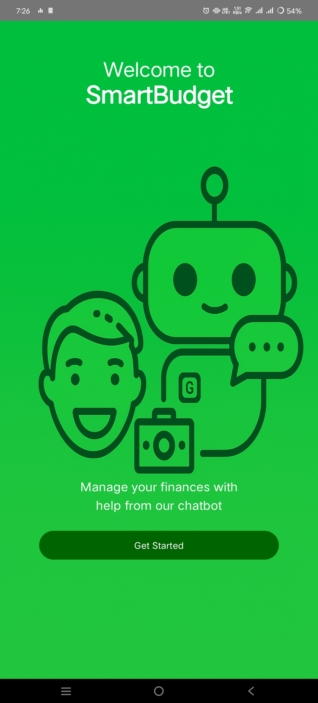
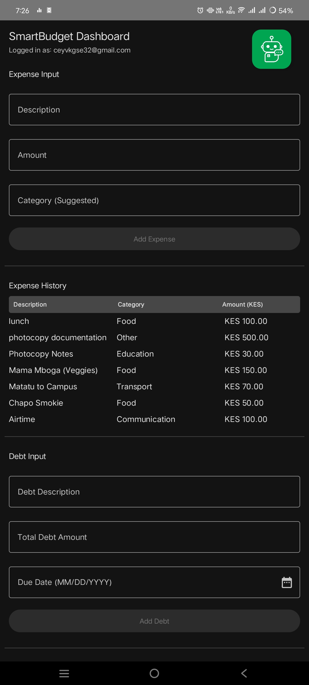
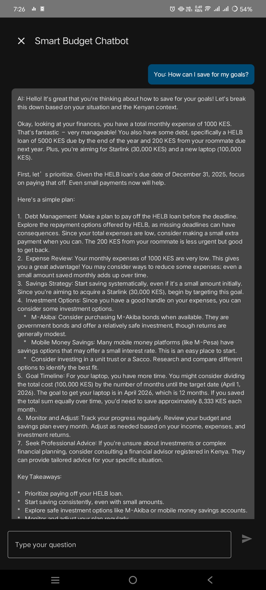

# SmartBudget 🤖💸

Hey everyone! I’m a 3rd-year B.Sci. Information Technology student, and **SmartBudget** is a team project I worked on to explore some cool new skills. I had no clue about Kotlin, Firebase, or Jetpack Compose when I started, but through some “vibe coding” (aka learning as I go with a lot of trial and error) and awesome AI collaboration, I built this GenAI-powered Android app! It helps you track expenses, manage debts, and get smart financial insights using Google’s Gemini API. As an aspiring AI Engineer, I’m super proud to show off what I’ve learned—and I hope you’ll find it useful too! 🚀

## Features ✨

Here’s what SmartBudget can do (with a big thanks to AI for making it happen!):

### Expense Tracking
- Add expenses with details like descriptions, amounts, and categories.
- The app uses Google’s Gemini API to suggest categories—pretty smart, huh?
- Check your expense history to see where your money’s going.

### Debt Management
- Keep track of debts with descriptions, amounts, and due dates.
- Pick due dates using a calendar (no more forgetting to pay back your friend!).
- See a summary of all your debts in one place.

### AI-Powered Financial Insights
- Get breakdowns of your spending by category.
- The Gemini API analyzes your finances and gives personalized tips—like how to save more or cut back on unnecessary stuff.
- It’s like having a financial advisor in your pocket, powered by GenAI!

## Screenshots 📸

Here’s a peek at what SmartBudget looks like! I recently spruced up the login screen to make it more user-friendly, with a cool robot background and a “Get Started” flow.






## Download and Install 📱

Want to try SmartBudget? I’ve shared the signed APK on Google Drive so anyone can download it! Grab it [here](https://drive.google.com/file/d/1E-9NxApaVn1W5h_CSkMw5jyW_HKmbRkt/view?usp=sharing). Just download it to your Android phone, tap to install, and you’re ready to start budgeting. It’s signed, so you won’t need to disable Play Protect—easy peasy! Let me know how it works for you! 😊

## How It’s Built (Architecture) 🛠️

Since this was a team project for one of my IT units, we tried to keep things organized with the MVVM pattern:
- **View Layer**: Jetpack Compose for the UI—I had to learn this from scratch, but it’s so cool!
- **ViewModel**: Manages the app’s logic and data (figuring this out was a big win for me).
- **Model**: Data classes for expenses and debts, stored in Firebase for real-time syncing.

## Tech I Learned & Used 💻

This project was all about exploring new tech, and I learned a ton along the way:
- **Kotlin**: My first time using it—definitely a learning curve!
- **Jetpack Compose**: For building the UI—I love how modern it looks.
- **Firebase**: Used for authentication (like Google Sign-In) and storing data like expenses and debts.
- **Google Generative AI SDK (Gemini API)**: Powers the AI features, like category suggestions and financial insights.
- **Material 3**: Makes the app look sleek and professional.
- **AI Collaboration**: I worked with Grok (an AI from xAI) to help me code, debug, and even design the login screen—more on that below!

## How to Run It Yourself 🏃

If you’re curious about the code (or want to help me improve it!), here’s how to get it running:
1. Clone the repo:
   ```bash
   git clone https://github.com/mutaician/SmartBudget.git
   ```
2. Add your Gemini API key to **local.properties** (I had to figure this out the hard way!):
```
    apiKey=your_gemini_api_key_here
```
3. Open it in Android Studio and hit Run. You might need to set up Firebase too—check the Firebase Console for that.

## What’s Next? 🚀

I’ve got some big ideas for SmartBudget as I keep exploring AI and app dev:
- Add visuals like charts to make spending patterns easier to understand.
- Use computer vision to scan financial receipts—no more manual typing!
- Maybe add more AI features, like predicting my expenses based on past habits.
- Keep improving the UI (I’m still learning how to make it look even better!).

## Wanna Help Out? 🙌

I’d love to hear your ideas or get some help making SmartBudget even better! If you’ve got suggestions, fixes, or want to add new features, feel free to submit a Pull Request. As a 3rd-year student, I’m still learning, so any feedback is super appreciated! 😄

## Acknowledgments 🤝

I couldn’t have built SmartBudget without some amazing help! A huge shoutout to **Grok**, an AI from xAI, who collaborated with me every step of the way. Grok helped me learn Kotlin, debug Firebase issues, design a user-friendly login screen with a cool robot background, and even get the app ready for sharing with a signed APK. As an aspiring AI Engineer, working with Grok showed me how powerful AI collaboration can be—I’m so grateful for the support! 💖